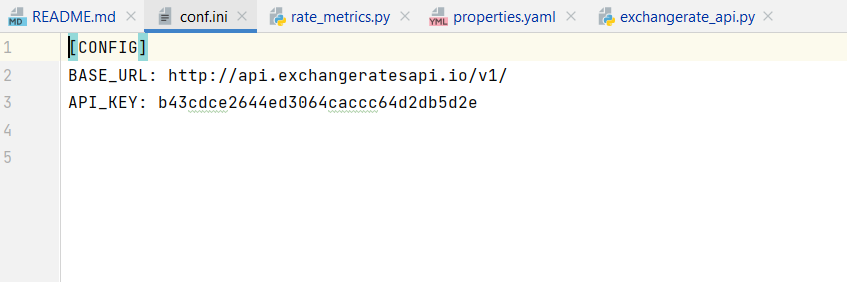
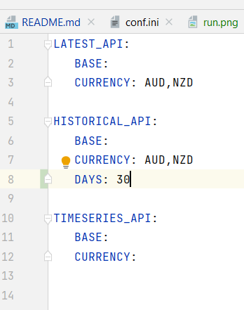
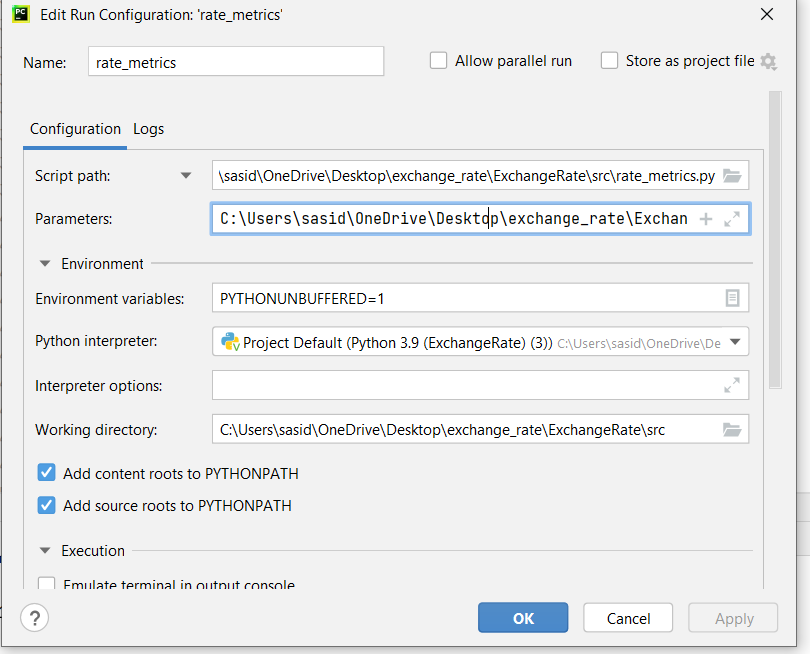
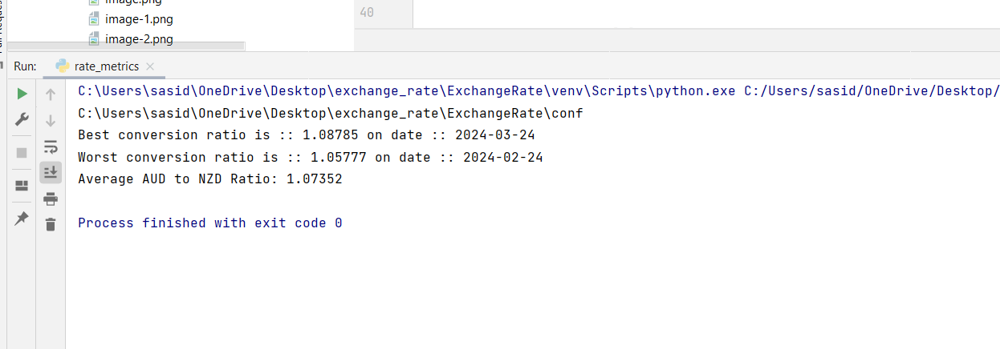
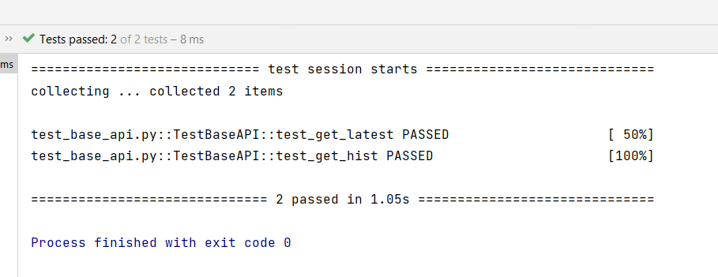

# Exchange Rate Analysis

This script retrieves historical exchange rate data between AUD (Australian Dollar) and NZD (New Zealand Dollar) for the last 30 days, analyzes it, and prints out some key metrics.

## Prerequisites
- Python 3.x
- Pandas
- requests
- pyYAML
- pytest
- pytest-mock

## Installation
1. Clone or download the repository.
2. Install the required dependencies using pip: Pandas, PyYaml, requests
3. Alternatively you can run this code from Juypter note book or Jupyterlab in git hub codespaces


## Usage
1. `conf/confi.ini` file is store base url of exchange rates api and access key(use your own access key if required)



2. `conf/properties.yaml` is to segregate different api call based on latest , historical , timeseries and takes api id
    - Number of historical days are configurable through yaml , just input the number of days from current date you want history for



3. Run the script `rate_mertics.py path_to_config`.(Main function currently configured to run only historical fetches) 
   Takes one argument config path(Not a named argument)
  

4. The script will:
  - Fetch historical exchange rate data for the input days in yaml
  - Analyze the data to find:
  - Best conversion ratio and its corresponding date.
  - Worst conversion ratio and its corresponding date.
  - Average conversion ratio.
- Print out the analysis results.
## Script Overview
- `get_data(conf_path)`: Fetches historical exchange rate data for the number of days mentioned in yaml file.
- `transform_data(data)`: Transforms the fetched data into a pandas DataFrame and calculates the AUD to NZD conversion ratio.
- `main()`: Main function that orchestrates the data retrieval, transformation, analysis, and printing.

5. Script `src/exchagerate_api.py` Initialize an instance of BaseAPI with your API ID ex:LATEST_API,HISTORICAL_API and optional parameters.
  - Call the appropriate methods to fetch exchange rate data:
## Script Overview
  - get_latest(): Fetches the latest exchange rates.
  - get_hist(hist_date): Fetches historical exchange rates for the specified date.
  - get_time_series(start_date, end_date): Fetches time series data within the specified date range.

## Running the Script
```bash
python rate_metrics.py /path/to/conf/
```


## Output


# BaseAPI Tests

This repository contains Python tests for the BaseAPI class, responsible for interacting with exchange rate APIs.

## Structure
tests/test_base_api.py: Holds the Pytest test cases.
## Dependencies

Python 3.6 or newer
pytest
pytest-mock (optional, for mocking external calls)
## Running Tests

``pytest test_base_api.py``

## Output


